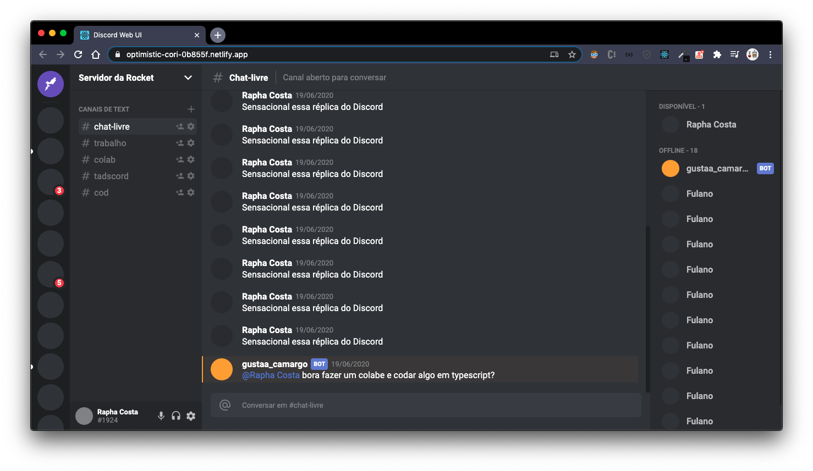

<h1 align="center">
  UI Copy - Discord
</h1>

<a href="https://optimistic-cori-0b855f.netlify.app/">Deploy</a>

  
  

# Result

<h4 align="center">
  
</h4>

# About the project

  This is a simple copy of the UI from Discord Web App, built just for study the techs used in the process.

# Techs

- Typescript
- Styled Components
- React

# Running

- Run `npm install` or `yarn install`.
- Run `npm start` or `yarn start` and wait for a browser's window to open, or access `localhost:3000`.